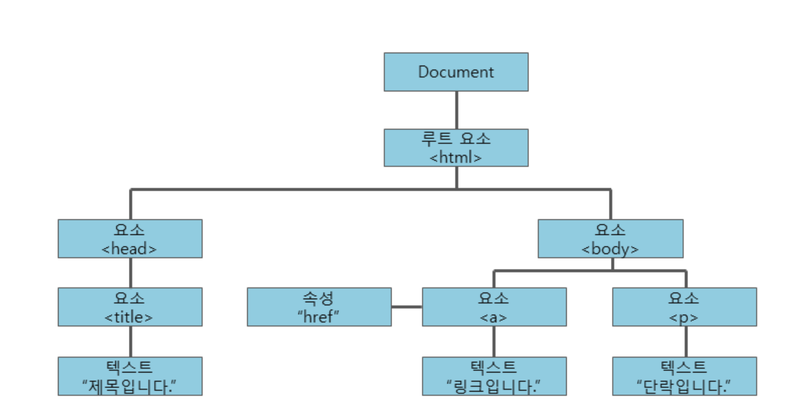

# DOM 

## DOM 이란?
> 문서 객체 모델(DOM, Document Object Model)은 XML이나 HTML 문서에 접근하기 위한 일종의 인터페이스이다. 이 객체 모델은 문서 내의 모든 요소를 정의하고, 각각의 요소에 접근하는 방법을 제공한다.  

> 자바스크립트는 이러한 객체 모델을 이용하여 다음과 같은 작업을 할 수 있다.

- 새로운 HTML 요소나 속성을 추가할 수 있다.
- 존재하는 HTML 요소나 속성을 제거할 수 있다.
- HTML 문서의 모든 HTML 요소를 변경할 수 있다.
- HTML 문서의 모든 HTML 속성을 변경할 수 있다.
- HTML 문서의 모든 CSS 스타일을 변경할 수 있다.
- HTML 문서에 새로운 HTML 이벤트를 추가할 수 있다.
- HTML 문서의 모든 HTML 이벤트에 반응할 수 있다.

**DOM 종류**

1. Core DOM : 모든 문서 타입을 위한 DOM 모델
2. HTML DOM : HTML 문서를 위한 DOM 모델
3. XML DOM : XML 문서를 위한 DOM 모델

**출처 : http://tcpschool.com/javascript/js_dom_concept**