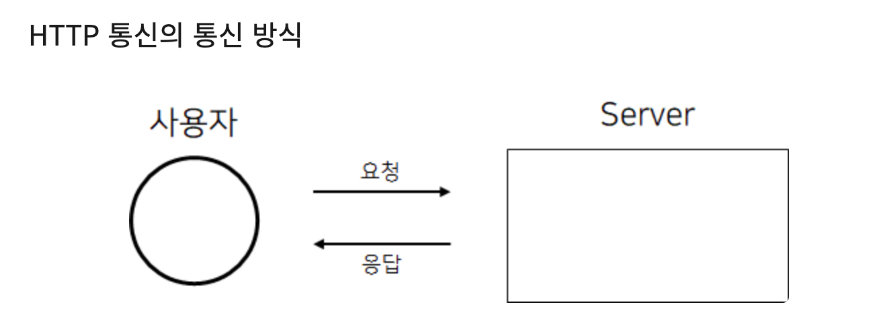
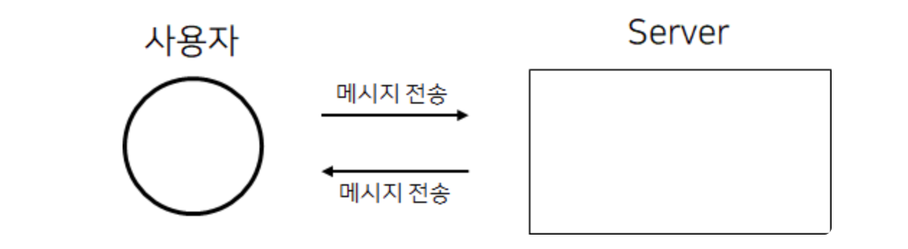

# HTTP 통신과 Socket 통신 📡

## HTTP 통신이란? 
> HTTP란 `Hyper Text Transfer Protocol` 의 약자로 HTML 파일을 전송하는 프로토콜이라는 의미를 가졌다. `HTML` 파일 뿐만 아니라 `JSON`, `Image` 파일 등도 전송된다.

## HTTP 통신 방법 

> HTTP 통신은 클라이언트에서 요청을 보내고 서버에서 응답을 하는 방식으로 통신한다. 응답에는 클라이언트의 요청에 따른 결과를 반환해준다.
```
클라이언트의 요청이 있을때만 응답한다. 즉 단방향 통신
```
> 초기에는 응답한 후 클라이언트(사용자)의 `Connection` 을 바로 끊어버렸으나, 최근에는 성능상의 이유로 `Keep Alive` 옵션을 통해 일정 기간동안 클라이언트와 `Connection` 을 유지하는 방식으로 통신이 가능해졌다.

---

## Socket 통신이란? 
> Socket이란 두 프로그램이 서로 데이터를 주고 받을 수 양쪽에 생성되는 통신 단자이다.

## Socket 통신 방법 

> Socket 통신이란 서버와 클라이언트 양방향 연결이 이루어지는 통신으로, 클라이언트도 서버도 서로에게 요청을 보낼 수 있다.
```
클라이언트와 서버 양쪽에서 서로에게 데이터 전달을 하는 방식, 즉 양방향 통신
```
> 채팅이나 스트리밍 등 실시간으로 값을 받아야하는 경구 자주 `Conncetion`을 끊는 HTTP 통신보다 Socket 통신이 더 적합하다.

---

**피드백은 언제나 환영입니다! 😇**   
**오타나 코드에 오류가 있으면 issue를 남겨주세요! 😁**   
**출처 : https://kotlinworld.com/75#recentComments**