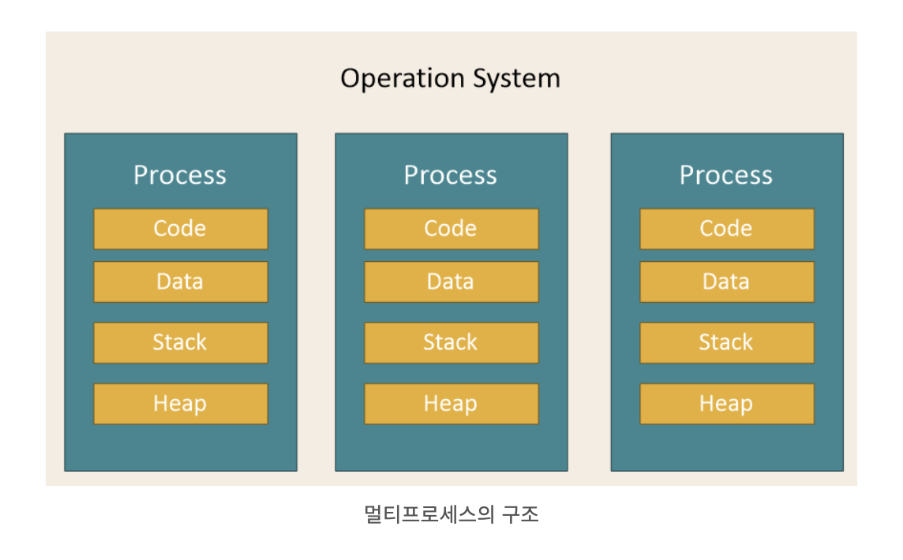
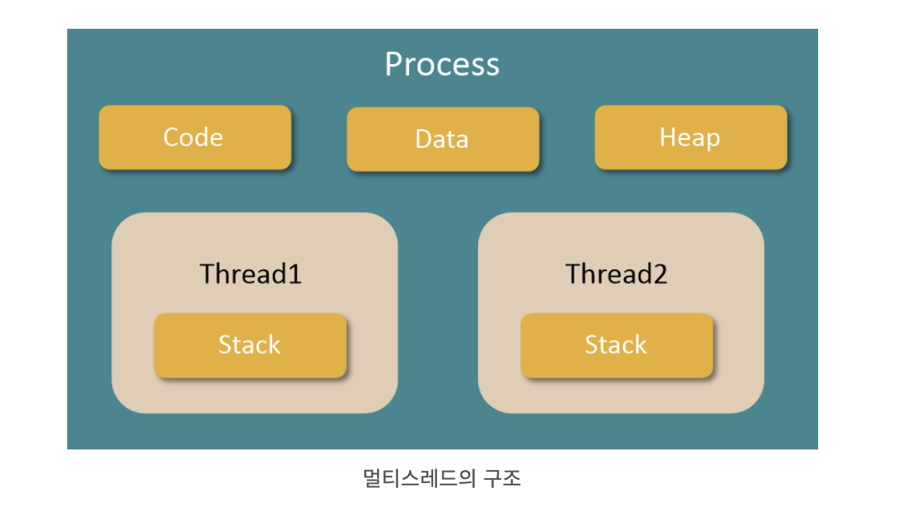

# 멀티프로세스와 멀티스레드

## 멀티프로세스

> 하나의 컴퓨터에 여러 CPU 장착 -> 하나 이상의 프로세스들을 동시에 처리(병렬)

**장점**

- 안정성이높음 (독립된 구조이기 떄문에)

**단점**

- 독립된 메모리 영역을 갖고 있어, 작업량 많을수록 오버헤드 발생. `Context Switching` 으로 인한 성능 저하

## 멀티스레드

**장점**

- 프로그램의 응답 시간이 단축된다.
- 시스템의 처리율이 향상된다.
- 시스템의 자원 소모 감소된다.
- 프로세스 간 통신 방법에 비해 스레드 간의 통신 방법이 훨씬 간단하다.

**단점**

- 여러 개의 스레드를 이용하는 경우, 미묘한 시간차나 잘못된 변수를 공유함으로써 오류 발생 가능  
   👉🏼 따라서 스레드 간에 통신할 경우에는 충돌 문제가 발생하지 않도록 동기화 문제를 해결해야 한다
- 프로그램 디버깅이 어렵다.
- 단일 프로세스 시스템에서는 효과를 기대하기 어렵다.

---

**피드백은 언제나 환영입니다! 😇**  
 **오타나 코드에 오류가 있으면 issue를 남겨주세요! 😁**
