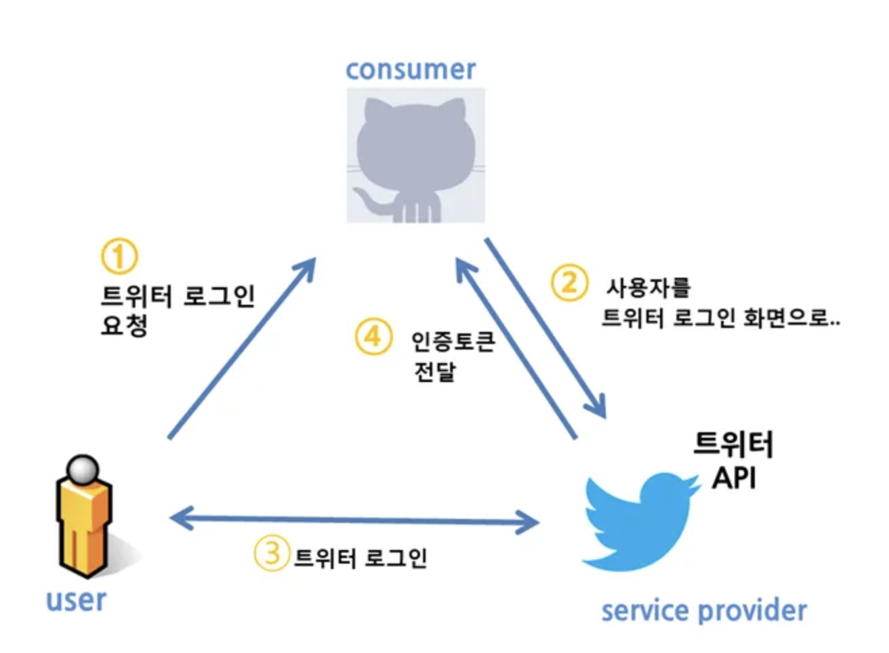
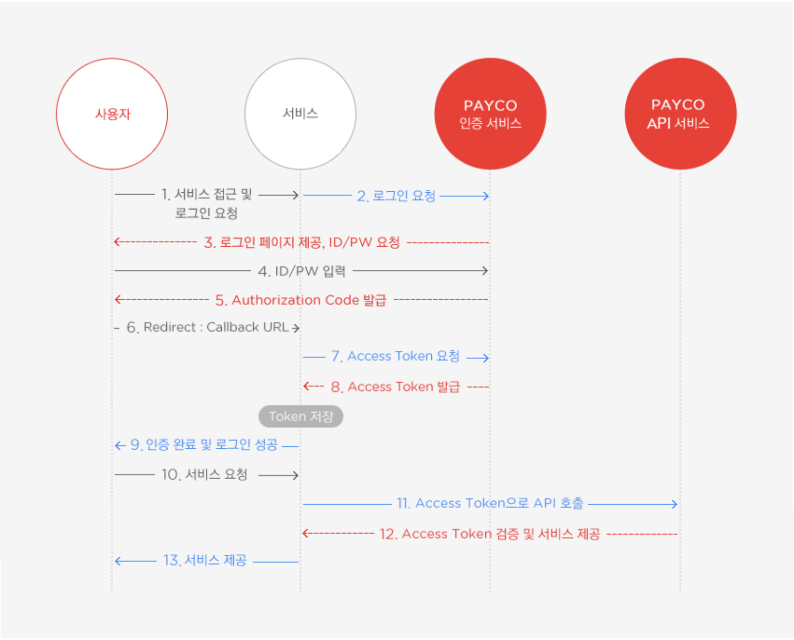

# OAuth란? 🎒

## 정의

> OAuth 2.0은 다양한 플랫폼 환경에서 권한 부여를 위한 산업 표준 프로토콜이다.

간단하게 인증(Authentication)과 권한(Authorization)을 획득하는 것으로 볼 수 있다.

- 인증은 시스템 접근을 확인하는 것 (로그인) -> 인증만 하는 것은 openID
- 권한은 행위의 권리를 검증하는 것

## OAuth 1.0

**OAuth 구성 (1.0a)**

**OAuth 1.0a 단점**

- 구현이 복잡하고 웹이 아닌 어플리케이션에서의 지원이 부족하다.
- HMAC을 통해 암호화를 하는 번거로운 과정을 겪는다.
- 인증토큰(access token)이 만료되지 않는다.

## OAuth 2.0

**달라진 점**

- 기능의 단순화, 기능과 규모의 확장성 등을 지원하기 위해 만들어 졌다
- 1.0a는 만들어진 다음 표준이 된 반면 2.0은 처음부터 표준 프로세스로 만들어짐.
- https가 필수여서 간단해 졌다.
- 암호화는 https에 맡김.
- 1.0a는 인증방식이 한가지였지만 2는 다양한 인증방식을 지원한다.
- api서버에서 인증서버를 분리 할 수 있도록 해 놓았다.

**OAuth 구성 (2.0a)**

- Resource owner: 사용자
- Client: Resource Server 에서 제공하는 자원을 사용하는 애플리케이션
- Resource server(API server): 자원을 호스팅하는 서버
- Authorization Server: 사용자의 동의를 받아서 권한을 부여하는 서버, 일반적으로 Resource Server 와 같은 URL 하위에 있는 경우가 많음.

**OAuth 인증프로세스**

발급받은 Access Token은 서비스에서 자체적으로 저장, 관리해야함
