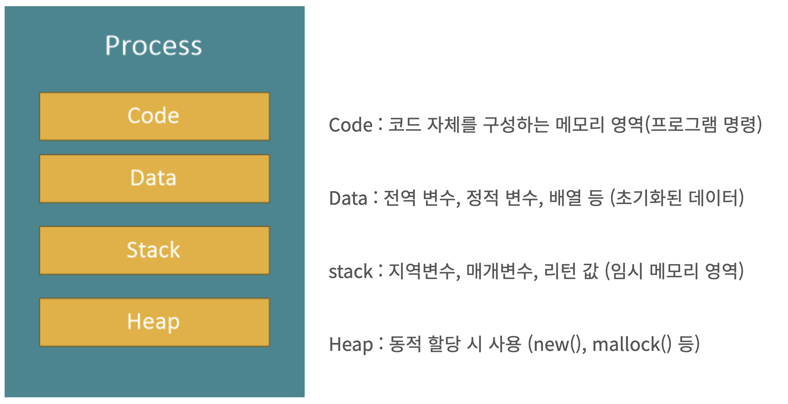
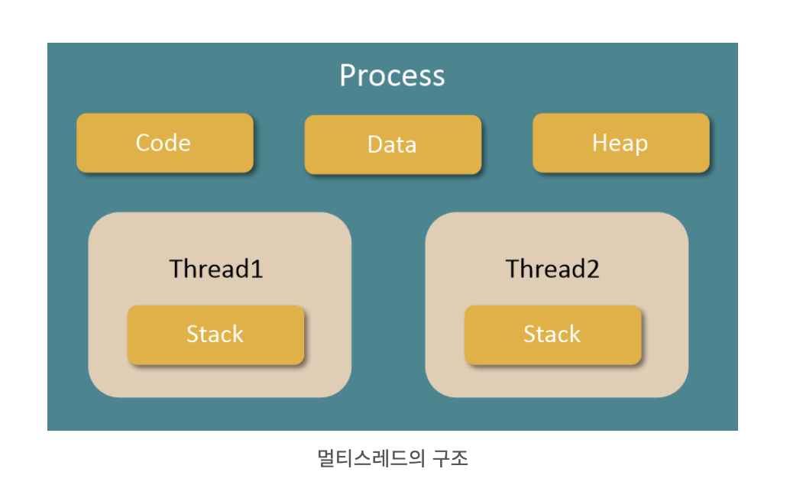

# 프로세스와 스레드의 차이

## 프로세스란

> 단순하게 말하면 `일을 처리하는 일련의 과정`을 말한다.

**컴퓨터에서의 프로세스란**

- 운영체제로부터 시스템 자원을 할당받는 작업의 단위
- 컴퓨터에서 연속적으로 실행되고 있는 프로그램
- 메모리에 올라와 실행되고 있는 프로그램의 인스턴스

> 하나의 프로세스는 크게 코드영역(Code), 데이터 영역(data), 스택 영역(stack), 힙 영역(heap) 4가지로 이루어져 있다.

> 여러가지 프로세스들이 한꺼번에 진행될때 여러 프로세스를 왔다 갔다 하는 `콘텍스트 스위칭(Context Switching)`이 발생한다.

> 반복이 많아지게 되면 CPU의 부담이 늘어나고, 중복된 자원들이 비효율적으로 관리된다. 그럴 때 사용하는 것이 바로 멀티스레드이다.

## 스레드란

> 한 프로세스 내에서 동작되는 여러 실행의 흐름으로 프로세스 하나에 자원을 공유하면서 일련의 과정을 여러 개를 동시에 실행시킬 수 있는 것을 말한다

- 한 프로세서 내의 주소 공간이나 자원들을 대부분 공유
- 기본적으로 하나의 프로세스가 생성되면 하나의 스레드가 같이 생성되며, 이를 메인 스레드라고 부르며, 스레드를 추가로 생성하지 않는 한 모든 프로그램 코드는 메인 스레드에서 실행된다.
- 하나의 프로세스는 여러 개의 스레드를 가질 수 있으며 이를 멀티 스레드라고 한다.
- 멀티스레드의 구조를 보면 다음과 같이 Code, Data, Heap영역을 공유하고 있으며, Stack만 스레드 별로 가지게 된다.

**피드백은 언제나 환영입니다! 😇**  
**오타나 코드에 오류가 있으면 issue를 남겨주세요! 😁**
