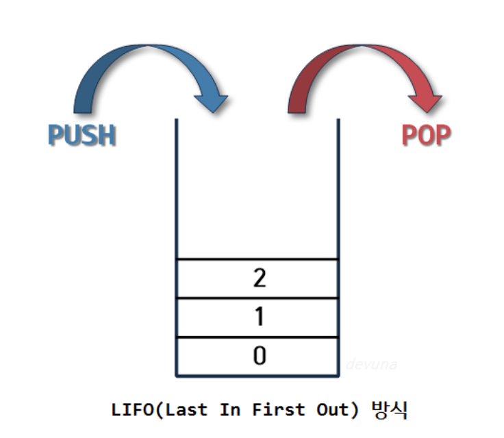
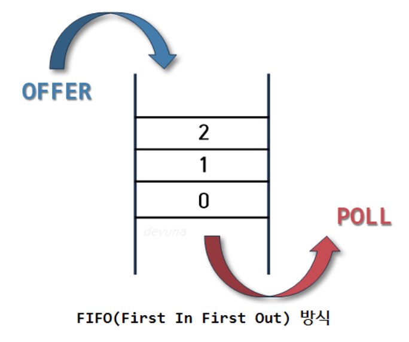

# Queue와 Stack의 차이

## 설명

**Stack**

> 스택은 쌓아 올린다는 것을 의미한다. 즉 차곡차곡 쌓아 올린 형태의 자료구조를 말한다.

**Stack의 특징**

1. 같은 구조와 크기의 자료를 정해진 방향으로만 쌓을수 있다.
2. top으로 정한 곳을 통해서만 접근할 수 있다.
3. top에는 가장 위에 있는 자료는 가장 최근에 들어온 자료를 가리키고 있으며 삽입되는 새 자료는 top이 가리키는 자료의 위에 쌓이게 된다.
4. 스택에서 자료를 삭제할 때도 top을 통해서만 가능하다.
5. 스택에서 top을 통해 삽입하는 연산을 'push' , top을 통한 삭제하는 연산을 'pop'이라고 한다.

> 이러한 스택의 구조를 후입선출(LIFO, Last-In-First-Out) 구조라고 한다.

**Queue**

> Queue 의 사전적 의미는 1. (무엇을 기다리는 사람, 자동차 등의) 줄 , 혹은 줄을 서서 기다리는 것을 의미한다.

**Queue의 특징**

1. 정해진 한 곳(top)을 통해서 삽입, 삭제가 이루어지는 스택과는 달리 큐는 한쪽 끝에서 삽입 작업이, 다른 쪽 끝에서 삭제 작업이 양쪽으로 이루어진다.
2. 이때 삭제연산만 수행되는 곳을 프론트(front), 삽입연산만 이루어지는 곳을 리어(rear)로 정하여 각각의 연산작업만 수행된다. 
3. 큐의 리어에서 이루어지는 삽입연산을 인큐(enQueue) 프론트에서 이루어지는 삭제연산을 디큐(dnQueue)라고 부른다.

> 이러한 큐의 구조를 선입선출(FIFO, First in first out) 구조라고 한다.

---

**피드백은 언제나 환영입니다! 😇**   
**오타나 코드에 오류가 있으면 issue를 남겨주세요! 😁**  