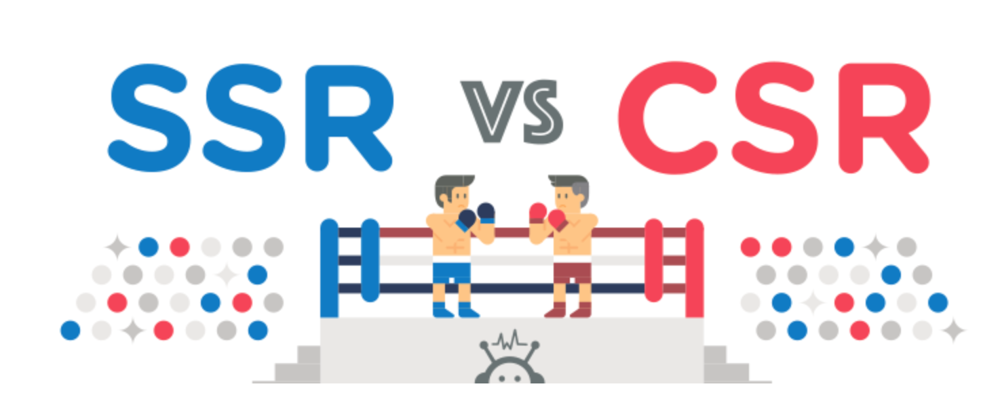

# SSR과 CSR 📟

## SSR 이란?
> `SSR` 이란 `Server Side Rendering` 이라는 뜻으로 클라이언트가 서버에 요청을 하면서 브라우저에 `html` 을 넘기게 되면 서버는 그 요청에 대한 결과값을 도출하여 만들어진 새로운 `html` 을 클라이언트에 넘겨준다.

> 매번 새로운 `html` 을 넘겨주다보니 반응 속도가 느리다.
```
클라이언트 요청 > html 리소스 전달 > 서버 결과값 계산 > html 리소스 전달 > 클라이언트 표시
```

## CSR 이란?
> `CSR` 이란 `Client Side Rendering` 이라는 뜻이다. `SPA(Single Page Application` 는 `CSR` 이다.

> 유저가 인터렉션한 화면 영역에만 변화가 필요한 경우에, 그 영역만 정보를 읽어들이고 서버에 전달한다. 그리고 받은 `json` 과 같은 리소스로 `view` 영역은 클라이언트가 처리하는 방식이다.
```
유저 요청 > HTML 파일과 연관된 js를 서버에서 보내줌 > 브라우저가 HTML 파일과 js를 받음 > 브라우저가 프레임 워크 실행 (view 표시 및 인터렉션 가능)
```

## SSR vs CSR

> 둘의 큰 차이가 있다면 `SSR` 은 유저에게 초기 진입 시 속도가 빠르게 느껴진다. (view를 모두 렌더한 채로 전달되기 때문에). 그러나 js를 다운로드-적용 하는 시간때문에 인터렉션이 되기까지 로딩이 있다.

> `CSR` 은 클라이언트 쪽에서 `view` 를 그리기 때문에 상대적으로 느리게 느껴질 수 있다. 하지만 `view` 가 보여진 후 이미지를 클릭하거나 인터렉션을 하게 되면 즉각적으로 클라이언트에서 `view` 를 새롭게 제공함으로써 인터렉션 속도는 빠르게 보여진다.

---
 
**출처 : https://n-square.tistory.com/40**