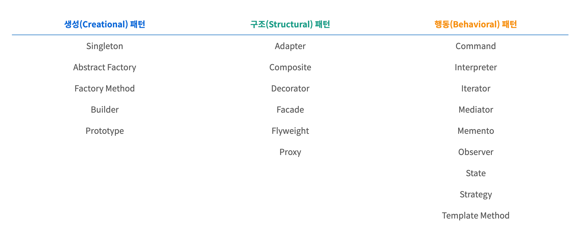

# Design Pattern 🎨

## 디자인패턴 이란? 
> 디자인패턴은 기존 환경 내에서 반복적으로 일어나는 문제들을 어떻게 풀어나갈 것인가에 대한 일종의 솔루션 같은 것이다.

> 디자인패턴은 설계자들이 **"올바른"** 설계를 **"빠르게"** 할 수 있도록 도와준다.

## 카테고리 
> 디자인패턴의 카테고리는 크게 **"생성패턴"** , **"구조패턴"** , **"행동패턴"** 3가지로 구분할 수 있다.

**피드백은 언제나 환영입니다! 😇**   
**오타나 코드에 오류가 있으면 issue를 남겨주세요! 😁**   
**출처 : https://antstudy.tistory.com/50**
