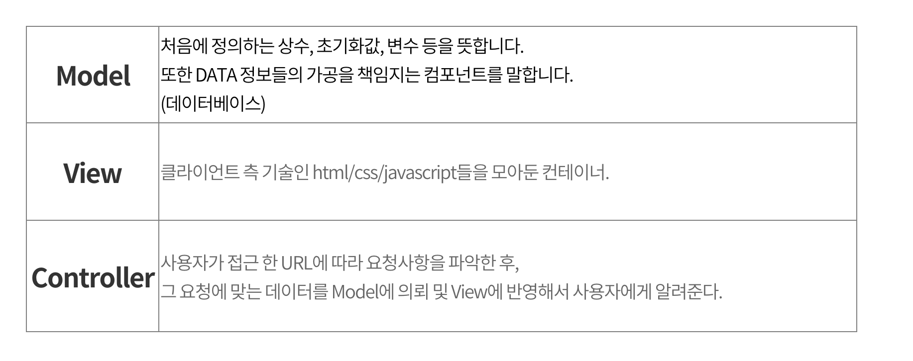

# MVC 패턴 💃

## MVC 패턴이란? 
> 어플리케이션을 **"Model"** , **"View"** , **"Controller"** 세가지 역할로 구분한 개발 방법론 이다.
- M = [Model]  애플리케이션의 정보(데이터)
- V = [View]  텍스트, 체크박스 항목 등과 같은 사용자 인터페이스 요소
- C = [Controller]  데이터와 비즈니스 로직 사이의 상호동작을 관리

## Model
> 모델은 도메인 레이어의 또 다른 이름이다. 도메인 로직은 가공되지 않은 데이터에 의미를 부여한다. 모델이 가지고 있어야 하는 것은 데이터 값과 데이터와 직접적으로 관련된 로직뿐이다. 어떠한 이벤트 헨들러, 뷰 템플릿과 로직도 혀용되지 않는다.

## View
> 인터렉션을 위해 모델을 적합한 형태로 랜더링 한다. 유저 인터페이스 부분이다. MVC는 주로 웹 어플리케이션에서 나타낸다. 뷰는 HTML 페이지이다. 그리고 페이지에서 다이나믹 데이터를 수집한다. 뷰는 어떠한 로직도 가지고 있으면 안되며 컨트롤러와 모델을 알아선 안된다.

## Controller
> 이벤트에 반응한다. 일반적으로 사용자의 행동이다. 아마도, 모델에 변화를 가하며 뷰에 영향을 끼친다. 사용자가 어떠한 행동을 했을 때, 컨트롤러 안에 있는 이벤트 트리거가 실행된다.

---

**출처 : https://kotlinworld.com/75#recentComments**