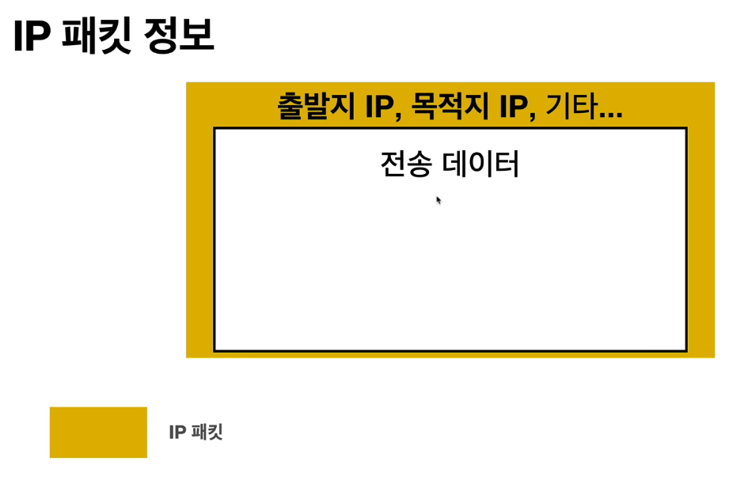

# IP (Internet Protocol)

**설명**

> 복잡한 인터넷 망 사이에 서버와 클라이언트가 서로 통신을 해야할때 따라야하는 최소한의 규칙이 필요하다. 그때 IP 주소라는걸 통해 통신한다.

**역할**

- 지정한 ip 주소(IP Address)에 데이터 전달
- 패킷(Packet)이라는 통신 단위로 데이터 전달

**과정**

- IP 주소 부여 : 서버와 클라이언트에 스스로의 ip주소가 있어야 한다.
- 패킷에 데이터를 담음

  

- 클라이언트 패킷을 인터넷망에 던짐
- 패킷안에 들어있는 목적지 IP로 인터넷망의 노드가 보내줌
- 서버에서도 똑같이 응답을 보담

## IP 프로토콜의 한계

- 비연결성

  - 패킷을 받을 대상이 없거나 서비스 불능 상태여도 패킷 전송

- 비신뢰성

  - 중간에 패킷이 사라지면 ?
  - 패킷이 순서대로 안오면 ?

- 프로그램 구분
  - 같은 IP를 사용하는 서버에서 통신하는 어플리케이션이 둘 이상이면 ?
