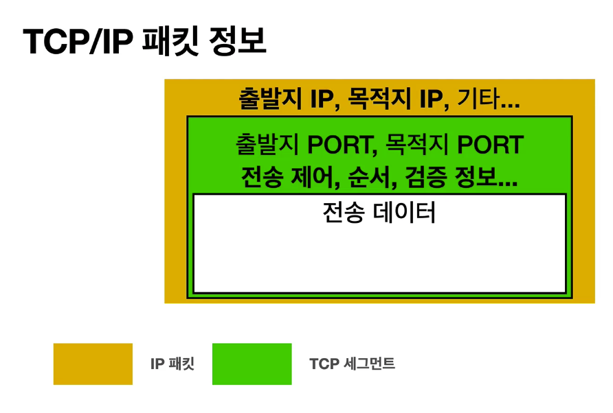
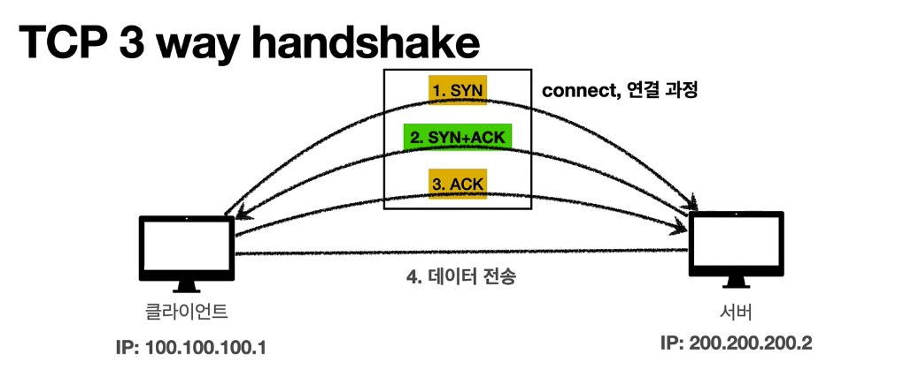
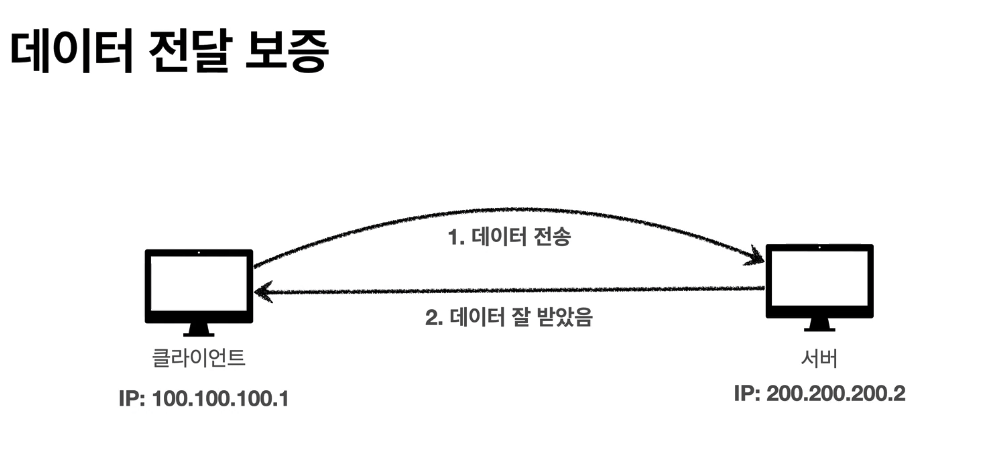
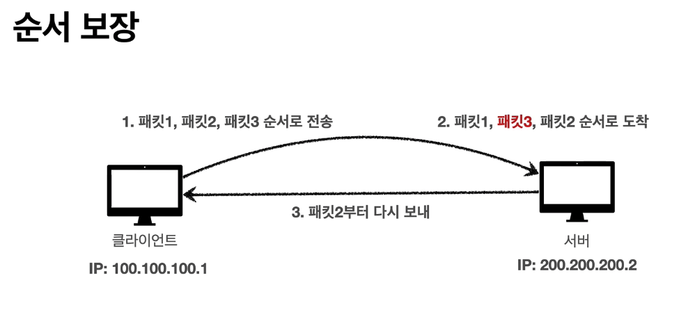

# TCP/UDP

## TCP

**설명**

> IP 프로토콜의 신뢰성, 패킷 전달 순서 문제 등등을 보완하기위해 TCP를 사용한다.

**구조**

> 출발지 PORT, 목적지 PORT 등이 들어간다. IP 만으로는 해결이 안되었던 문제들을 해결할 수 있다.

**특징**

- 연결지향 - TCP 3 way handshake (가상연결)

SYN : 접속 요청  
ACK : 요청 수락  
참고 : 3. ACK와 함께 데이터 전송 가능

- 데이터 전달 보증

- 순서 보장

- 신뢰할 수 있는 프로토콜
- 현재는 대부분 TCP 사용

## UDP

**특징**

- 하얀 도화지에 비유 (기능이 거의 없음)
- 연결지향 x
- 데이터 전달 보증 x
- 순서 보장 x
- 데이터 전달 및 순서가 보장되지 않지만, 단순하고 빠름
- 정리
  - IP와 거의 같음 + PORT + 체크섬 정도만 추가
  - 애플리케이션에서 추가 작업 필요
