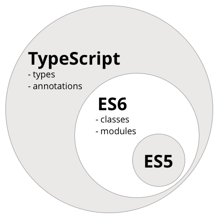

# Typescript 🔎

## 설명 🔎

**Typescript란?**
> 타입스크립트는 자바스크립트에 타입을 부여한 언어이다. 즉 자바스크립트의 확장된 언어라고 볼 수 있다.



---

## 설치 🔎
> 다음 코드를 입력하여 디렉터리 내부에 `package.json` 파일을 설치한다.
```
$ mkdir ts-practice
$ cd ts-practice 
$ yarn init -y
```

> 이젠 타입스크립트 설정파일인 `tsconfig.json` 을 프로젝트 내부에 설치해야 한다.
```
$ yarn global add typescript
```
> 먼저 `Typescript` 를 글로벌로 설치해준다. 그 후 디렉터리 내부에 `tsc --init` 명령어를 입력하면  `tsconfig.json` 이 자동생성된다.  

---

## 기본 타입 🔎
> 먼저 코드를 작성해준다.
```javascript
let count = 0; // 숫자
count += 1;
count = '갑자기 분위기 문자열'; // 에러

const message: string = 'hello world'; // 문자열

const done: boolean = true; // 불리언 값

const numbers: number[] = [1, 2, 3]; // 숫자 배열
const messages: string[] = ['hello', 'world']; // 문자열 배열

messages.push(1); // 숫자 넣으려고 하면 안됨

let mightBeUndefined: string | undefined = undefined; // string 이거나 undefined
let nullableNumber: number | null = null; // number 이거나 null 

let color: 'red' | 'orange' | 'yellow' = 'red'; // red, orange, yellow 중 하나
color = 'yellow';
color = 'green'; // 에러
```
> TypeScript 를 사용하면 이렇게 특정 변수 또는 상수의 타입을 지정 할 수 있고 우리가 사전에 지정한 타입이 아닌 값이 설정 될 때 바로 에러를 발생시킨다.

---

## 인터페이스 🔎
> Typescript의 핵심 원칙은 값의 형태에 초점을 맞추고 있다는 것이다. Typescript에서 인터페이스는 이런 타입들의 이름을 짓는 역할을 해준다.

**인터페이스** 🔎
```javascript
function printLabel(labeledObj: { label: string }) {
    console.log(labeledObj.label);
}

let myObj = {size: 10, label: "Size 10 Object"};
printLabel(myObj);
```
> 위의 예제를 인터페이스를 사용하면 및의 예제로 작성할 수 있다.

```javascript
interface LabeledValue {
    label: string;
}

function printLabel(labeledObj: LabeledValue) {
    console.log(labeledObj.label);
}

let myObj = {size: 10, label: "Size 10 Object"};
printLabel(myObj);
```
> 이 예시와 같이 인터페이스는 타입을 미리 선언을 해준다고 할 수 있다.

**선택적 인터페이스** 🔎
> 인터페이스의 프로퍼티에 조건을 넣어줄 수 있는데 이것을 선택적 인터페이스라고 한다.

```
interface SquareConfig {
    color?: string;
    width?: number;
}
```
> 이런식으로 `?` 를 붙이면 `color` 의 값이 `string` 일수도 아닐수도 있다.

**type alias** 🔎
> `type` 은 특정 타입에 별칭을 붙이는 용도로 사용한다. 이를 사용하여 객체를 위한 타입을 설정할 수도 있고, 배열, 또는 그 어떤 타입이던 별칭을 지어줄 수 있다.

```javascript
type Person = {
  name: string;
  age?: number;
};
```
> 이런 식으로 지정해줄 수 있다.

---

## Generics 🔎
> 제네릭은 타입스크립트에서 함수,클래스,interface,type alias를 사용할때 여러 종류의 타입에 대해 호환을 맞춰야 하는 상황에서 사용하는 문법이다.

**함수에서 Generic 사용하기** 🔎
> 함수에서 Generic을 사용하여 타입 유추를 할 수 있다.

```javascript
function merge<A, B>(a: A, b: B): A & B {
  return {
    ...a,
    ...b
  };
}

const merged = merge({ foo: 1 }, { bar: 1 });
```
> 이렇게 함수에서 Generic을 사용하면 파라미터로 다양한 타입을 넣을 수도 있고 타입 지원을 지켜낼 수 있다.

**Interface에서 Generic 사용하기** 🔎
> Interface에서도 Generic을 사용할 수 있다.

```javascript
interface Items<T> {
  list: T[];
}

const items: Items<string> = {
  list: ['a', 'b', 'c']
};
```

**type에서 Generic 사용하기** 🔎
> Interface에서 Generic을 사용한 것과 유사하다.

```javascript
type Items<T> = {
  list: T[];
};

const items: Items<string> = {
  list: ['a', 'b', 'c']
};
```

**class에서 Generic 사용하기** 🔎
> class에서 Generic을 사용할 수 있다.

```javascript
class Queue<T> {
  list: T[] = [];
  get length() {
    return this.list.length;
  }
  enqueue(item: T) {
    this.list.push(item);
  }
  dequeue() {
    return this.list.shift();
  }
}
```
> 위 코드는 `Queue` 구현코드 중 일부이다.

---

**피드백은 언제나 환영입니다! 😇**   
**오타나 코드에 오류가 있으면 issue를 남겨주세요! 😁**   
**출처 : 패스트캠퍼스 강의 - 벨로퍼트와 함께하는 Typescript, Typescript 공식문서**